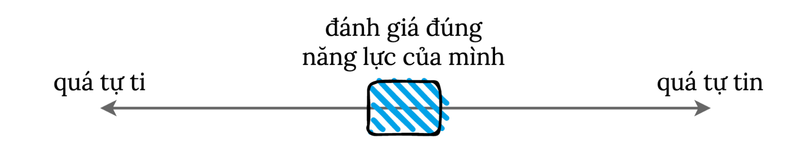

Ngược lại với các ứng viên mà Adam Grant nói đến ở bài trước, nhiều bạn sinh viên Việt Nam lại hay khiêm tốn thái quá: không khoe đủ, không đủ tự tin để cho mọi người thấy rằng mình làm được những gì.

Hồi bé, mỗi lần đi thi về là mình với các bạn đứa nào cũng "làm bài chán lắm", xong lúc trả bài thì toàn 9.75 với 10.
Đến khi đi du học, mỗi lần được thầy khen gì là mình xấu hổ, không biết phải trả lời thế này nên mình chối, thấy nói quá, em đâu có giỏi lắm đâu.
Mỗi lần như vậy, về nhà, mình lại suy ngẫm xem có cách nào graceful hơn để đáp lại những lời khen không.
Mình kết luận một câu trả lời nhã nhặn gồm 3 phần:

-   Thanks: Em cảm ơn thầy.
-   Acknowledge it was hard work: Em dành khá nhiều thời gian rèn dũa, duyện tập. Em rất vui vì được kết quả như mong muốn.
-   Wish/Desire to learn more: Em hi vọng sẽ học được nhiều hơn và làm tốt hơn trong lần tới.

Năm cuối đại học, mình ở cùng nhà với một bạn tên Alex.
Lúc đấy là mùa xin việc, các công ty bắt đầu tuyển sinh viên vào làm.
Alex có phỏng vấn ở vài công ty, nhưng công ty hắn thích phỏng vấn cuối cùng nên hôm đấy hắn cũng hơi bồn chồn.
Tối về, mình hỏi Alex chiều nay mày interview thế nào, hắn trả lời: "I did really well".
Mình nghĩ bụng, ủa kì ha.
Mình chưa bao giờ dám trả lời vậy.
Toàn là "Không biết nữa" hay bi quan hơn: "Tệ lắm, chắc không được".

Vậy làm sao để mình khoe vừa, không khoe quá?
Làm sao để tìm được cái sweet spot trên cái phổ từ tự ti đến quá tự tin?
My advice: các bạn hãy lấy sự thật làm kim chỉ nam, tập trung vào niềm đam mê, mong muốn khám phá của mình.
Focus on your curiosity and desire to learn more.
Thay vì liệt kê thành tích bạn giành được bao nhiêu học bổng ABC (thường thông tin này đã có trong resume), bạn hãy kể về việc tại sao bạn lại apply cho cái học bổng ấy, và quy trình đó khó khăn như thế nào, có những ai giúp đỡ bạn, bạn cảm thấy may mắn ra sao, và bạn làm được những gì nhờ cái học bổng ấy.
 

#### Chân thành với người đọc và cũng là với chính mình.

Mục đích của thư xin nhập học, thư xin việc và những buổi phỏng vấn là để hai bên xem xem có hợp nhau không.
Thường trong cuối buổi phỏng vấn sẽ có cơ hội cho bạn hỏi lại người phỏng vấn.
Alex cuối cùng thì cũng không được nhận làm việc chỗ đấy[^1].
Mình nghĩ không phải Alex khoe quá hay chủ quan quá.
Chuyện một ứng viên trúng tuyển hay không phụ thuộc vào nhiều yếu tố lắm 
(Viết thêm về chủ đề này How to Accept Rejections chắc phải mất vài trang khác).
Nhưng dù trả lời một cách lạc quan hay bi quan cho câu hỏi của mình, mày interview thế nào, Alex hài lòng với chính bản thân vì hắn đã cố gắng hết sức rồi.

[^1]: Nhưng bây giờ hắn có việc làm tốt lắm rồi, yêu công việc lắm, bạn đừng lo.

### Be skeptical

Mình viết bài này contrast với bài của Adam Grant mong bạn suy ngẫm thêm về những thông tin mà bạn đọc được ở đây đó, kể cả những bài viết của bọn mình.
Trong môi trường với quá nhiều thông tin như hiện tại, chúng ta nên sáng suốt để không tiêu thụ bị động mà suy nghĩ, chất vấn những thông tin được đưa ra.
Làm sao để từ mặc định tư duy trắng đen, chỉ có hai mặt đúng sai, mình luyện tập để cố gắng [tư duy theo phổ](https://youtu.be/hae4gBzeBeU).
Và làm sao để sửa đổi những lời khuyên nhủ, dặn dò của mọi người cho phù hợp với văn hoá, hoàn cảnh bản thân mình.

> As consumers of information, we have a role to play in embracing a more nuanced point of view.
> When we're reading, listening, or watching, we can learn to recognize complexity as a signal of credibility.
> We can favor content and sources that present many sides of an issue rather than just one or two.
> When we come across simplifying headlines, we can fight our tendency to accept binaries by asking what additional perspectives are missing between the extremes.

*— Adam Grant, [Think Again](https://www.goodreads.com/book/show/55539565-think-again)*
