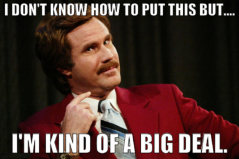

 
<small><i>
Đây là bản dịch lại của bài báo tiêu đề <a href="https://www.linkedin.com/pulse/job-interview-how-acknowledge-your-weaknesses-adam-grant/">In a Job Interview, This Is How to Acknowledge Your Weaknesses</a> của nhà tâm lí học Adam Grant, đăng ngày 31/7/2016 trên LinkedIn
 
Trang Lê dịch, với sự giúp đỡ của Google Translate
 

</i>
</small>

Hai năm trước, một phụ nữ trẻ tên Michele Hansen tìm thấy một công việc mà cô rất thích.
Tuy nhiên, cô ấy không đủ tiêu chuẩn: vị trí tuyển dụng dành cho người quản lý sản phẩm tại một công ty đầu tư, nhưng cô lại không có kinh nghiệm về dịch vụ tài chính.

Trong trường hợp tương tự, bạn sẽ có xu hướng thổi phồng trình độ của mình lên để che đi những thiếu sót của mình.
Khi tôi phỏng vấn và yêu cầu ứng viên liệt kê điểm yếu lớn nhất của mình, họ thường trả lời bằng những điểm mạnh được ngụy trang: Tôi làm việc quá sức, Tôi quá cầu toàn, Tôi chỉ giành được huy chương bạc trong Thế vận hội.
:2nd_place_medal:

Nhưng Michele Hansen đã làm điều hoàn toàn ngược lại, y hệt như George Costanza trong Seinfeld: "Tên tôi là George. Tôi thất nghiệp và tôi sống chung với bố mẹ."

Thay vì cố gắng che giấu những thiếu sót của mình, cô ấy đã viết hết ra ngay từ đầu:

> Tôi có lẽ không phải là ứng cử viên mà anh chị hình dung.
> Tôi không có mười năm kinh nghiệm trong lĩnh vực quản lí sản phẩm.
> Tôi cũng không có bằng kế toán.

Hansen được mời nhận việc.
Câu chuyện của Hansen không phải một trường hợp cá biệt.
Một nghiên cứu cho thấy, trong một cuộc tuyển sinh ngành kinh doanh của một trường đại học, cộng đồng tuyển sinh thích những ứng viên thật thà hơn là quá tích cực[^1].
Trong một nghiên cứu khác, các nhà khoa học ở đại học Harvard yêu cầu sinh viên trả lời câu hỏi phỏng vấn xin việc về khuyết điểm của họ.
23% sinh viên đưa ra những phẩm chất tiêu cực thực sự:

[^1]: who were more concerned with being seen accurately than positively

-   Tôi trì hoãn.
-   Tôi phản ứng thái quá với các tình huống.

77% còn lại che giấu điểm yếu của mình bằng một lời ***khoe khoang khiêm tốn***[^2]:

[^2]: [humblebragging](https://doi.org/10.2139/ssrn.2597626)

-   Tôi quá hiền.
-   Tôi quá công bằng.

Kết quả là những bạn sinh viên thừa nhận điểm yếu thực của mình có khả năng ứng tuyển cao hơn 30% so với số còn lại.

Mặc dù mọi người nghĩ tự quảng bá bản thân là tấm vé để có được một công việc ta hằng mơ ước, nhưng thực tế không phải vậy.
Việc nhấn mạnh kĩ năng và thành tích của mình không làm tăng tỉ lệ sinh viên được mời nhận việc.
Những giám đốc điều hành dùng trình độ của mình để gây ấn tượng với hội đồng quản trị cũng không giành được nhiều ghế hơn.
Những nhân viên nào mà tìm mọi cách để làm nổi bật những thành tích của họ có mức lương và tỷ lệ thăng tiến thấp hơn đáng kể.
Nhà nghiên cứu James Westphal và Ithai Stern giải thích, so với xu nịnh và ưu ái, việc tự quảng bá bản thân là kém hiệu quả nhất quán để đi lên... Nó chình ình ra.

Sau hai nghiên cứu về vấn đề này, Alison Fragale và tôi kết luận rằng việc tự quảng cáo chỉ được đền đáp khi khán giả đủ phân tâm để ghi nhớ thông tin mà quên mất nguồn gốc.
Còn không thì họ biết thừa:

> Nếu bạn vĩ đại như vậy thì bạn đã không cần khoe khoang về sự vĩ đại của mình.

Tất nhiên, bạn không thể xin được việc nếu chỉ tập trung vào những điểm yếu của mình.
Sau khi thật thà rằng mình ít kinh nghiệm, Michele Hansen đã dành phần còn lại của thư xin việc để thuyết phục ban quản trị rằng cô ấy có động lực và kỹ năng để thành công.
Cô viết:

> Tôi không đợi mọi người bảo tôi phải làm gì.
> Tôi tự mình tìm những gì cần phải làm.
> Tôi có đầu óc của một doanh nhân, có việc gì là xong việc đấy.
> Tôi thích khám phá những điều mới mẻ và bắt đầu lại từ đầu.

Trong xã hội của chúng ta, phụ nữ tự quảng bá mình còn bị ghét hơn nữa.
Theo định kiến từ xưa đến nay, phụ nữ phải hướng về cộng đồng hơn là chính bản thân mình, không được khoe khoang, không được thể hiện sự tự tin và tham vọng.
Đây là lí do vì sao tỷ lệ ủng hộ Hillary Clinton tăng lên mỗi khi bà ấy nắm giữ một chức vụ và giảm xuống khi bà ấy tranh giành một chức vụ (theo Nate Silver).
Michele Hansen đã vượt qua định kiến này bằng cách thẳng thắn và khiêm tốn chỉ ra những thiếu sót của mình.
Do đó, những nhận xét về điểm mạnh của cô ấy trở nên đáng tin cậy hơn.

Bằng cách thừa nhận những thiếu sót của mình, bạn cho nhà tuyển dụng thấy rằng bạn **hiểu chính mình đủ để biết những lĩnh vực cần cải thiện của mình---và đủ tự tin để cởi mở về chúng**.
Rằng bạn quan tâm đến việc được tuyển dụng vì những gì bạn thực sự mang đến cho công ty, chứ không phải những gì bạn giả vờ mang đến.

Năm 1987, Chicago Sun-Times phải thay thế người phụ trách chuyên mục tư vấn yêu quý của họ, Ann Landers.
Một nhà báo trẻ tên Jeff Zaslow quyết định xin việc.
"Anh trẻ như vậy làm sao đủ bản lĩnh để tư vấn người khác?" một người phỏng vấn giễu.
"Có thể tôi mới 28 tuổi," Zaslow trả lời, "nhưng tôi có sự khôn ngoan của một người 29 tuổi."

Anh ấy được nhận việc.
