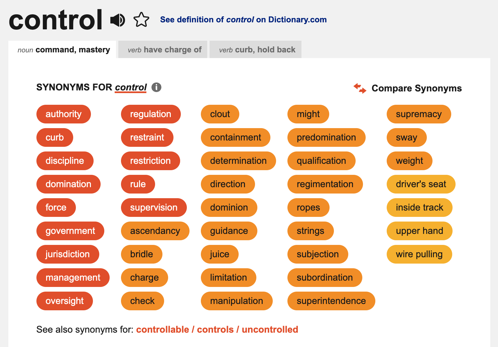

#### Tadahhhhh, chúng ta đã có ý tưởng, đã có dàn bài, đã có những câu đơn câu phức đan xen. Ơ nhưng sao các từ cứ lặp đi lặp lại ấy nhỉ? Sao cứ dùng do với make hoài, có đơn giản quá không? Làm sao để bài viết của mình tự nhiên hơn?

Welcome các bạn đến bước cuối cùng của quá trình chỉnh sửa một bài viết.
Sau đây mình sẽ chia sẻ với các bạn các cách mình dùng để làm tăng sự phong phú của từ vựng trong bài viết.

## Danh từ ↔ động từ ↔ tính từ

Bạn có thể linh hoạt thay đổi danh từ, động từ, tính từ bằng cách sử dụng các từ trong cùng một word family hoặc từ gần nghĩa.
Ví dụ:

> I am proud of my work.
> → I take pride in my work.
>
> I was worried about being bullied again.
> → I feared of being bullied again.

*Proud* (adjective) và *pride* (noun) ở trong cùng một word family, trong khi *worried* (adjective) and *fear* (verb) là hai từ khá khác nhau nhưng cùng thể hiện gần ý bạn muốn nói.

## Từ đồng nghĩa, trái nghĩa

[thesaurus.com](https://www.thesaurus.com/) là một công cụ khá hiệu quả mình hay sử dụng để tìm synonyms và antonyms, tuy nhiên không phải cứ lấy bừa một từ trong danh sách là xong.
Các bạn cần biết chính xác điều mình muốn truyền đạt là gì, sau đó tìm đúng từ thể hiện ý mình muốn đưa ra.

> I longed for a higher position to have official control.

Ý của bạn là "Tôi muốn có vị trí cao hơn để có quyền lực" (trong một câu lạc bộ ở trường).
Nhưng từ *control* lại mang cảm giác *kiểm soát*, nên chúng ta sẽ check thử xem Thesaurus cho gợi ý thế nào nhé.

Nhìn vào đây, chúng ta thấy là những từ màu đỏ là những từ gần nghĩa với control nhất.
Tuy nhiên trong list này có những từ như là *government*, *jurisdiction*, *rule*, *domination*, *force*, *curb*....
không phù hợp với ý tưởng bạn muốn diễn đạt.
Chỉ có từ *authority* là phù hợp với ý tưởng bạn muốn trình bày mà thôi.
Việc sử dụng thesaurus khó ở chỗ đó.
Bạn cần biết chính xác bạn muốn trình bày gì và phải tìm được từ diễn đạt đúng điều bạn muốn nói.

#### "But I'm out of synonymns", you exclaim, "I have used interesting and exciting and intriguing and I'm out of words". In that case, I suggest you add a different dimension to your essay.

Trong nhiều essays bọn mình sửa, mình thấy các từ excited, eager, enthusiastic, interested, etc. được dùng lặp đi lặp lại rất nhiều.
Thay vì cố gắng tìm một từ khác để diễn đạt cùng một ý như thế, mình nghĩ bạn nên tìm một ý mới, một hướng đi mới cho bài viết của mình.

## Paraphrase tool

Một công cụ mình rất thích dùng để viết lại câu là [QuillBot](https://quillbot.com/)[^1].
Tuy nhiên, tương tự như Thesaurus, mình muốn caution bạn trước là không phải lúc nào mấy cái AI tools này cũng đúng/hay, nên bạn phải cực kì tỉnh táo khi dùng chúng.
Ví dụ:

[^1]: bọn mình đã đề cập ở mục \[Resources\](../../../resources/bunch-of-links/)

Original version:

> It's been a long time since I last wrote something, sorry for that.
> I've just recently realized how physically weak I am, so, for the last two weeks, I've been working hard on exercises.
> Anyway, it doesn't count as an excuse for my laziness.

Quillbot's version:

> I apologize for not having published anything in a while.
> I've been putting a lot of effort into my workouts for the past two weeks since I just lately noticed how terrible my physical condition is.
> Anyway, it's not a valid justification for my sloth.

Revised version:

> Apologies for having been absent!
> This is not an excuse, but working out has occupied the majority of my time the past two weeks: I have only recently realized how out of shape I was.
> But now, with a healthier body and sharper mind, I intend to write more often (and better).

Mình đưa ra ví dụ này để bạn thấy là, cả 3 versions đều được, nhưng tuỳ vào ý bạn muốn nói, Quillbot có thể cho một alternative, một vài ý tưởng để bạn revise tốt hơn.

## Đối tượng của bạn là ai?

Ngoài ra, các bạn cần phải chú ý đến **đối tượng đọc bài của bạn** nữa.
Những người đọc Personal Statement là những người biết nhiều về ngành học hơn bạn, nên không phải cứ viết thật nhiều những thuật ngữ chuyên ngành là có thể gây ấn tượng được đâu.
Cũng đừng quá lo lắng nếu các bạn tự thấy "sao bài của mình không nhiều từ chuyên ngành? có bị thiếu chuyên nghiệp không?" Thay vào đó, hãy tìm hiểu về điều kiện của ngành (requirements) và sử dụng personal statement như một cơ hội để thể hiện khả năng của bản thân sẽ học tốt ngành đó.
Thể hiện như thế nào thì chúng ta quay lại bước [Tìm ý](../02-ideas) nhé. 

Vậy là cơ bản mình đã chia sẻ với các bạn 4 nội dung chính của việc viết một bài luận nói chung và personal statement nói riêng.
Trong những bài sau, mình sẽ đi cụ thể vào những ví dụ nhỏ để các bạn có thể hiểu rõ hơn nhé. 
