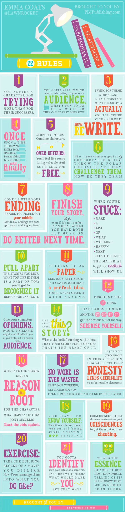

  

  
**1:** You admire a character for trying more than for her or his successes.

**2:** You gotta keep in mind what's interesting to you as an audience, not what's fun to do as a writer.
They can be very different.

**3:** Trying for theme is important, but you won't see what the story is actually about till you're at the end of it.
Now rewrite.

**4: Once upon a time there was \_\_\_. Every day, \_\_\_. One day \_\_\_. Because of that, \_\_\_. Because of that, \_\_\_. Until finally \_\_\_.**

**5:** Simplify.
Focus.
Combine characters.
Hop over detours.
You'll feel like you're losing valuable stuff, but it sets you free.

**6:** What is your character good at, comfortable with?
Throw the polar opposite at them.
Challenge them.
How do they deal?

**7:** Come up with your ending before you figure out your middle.
Seriously.
Endings are hard --- get yours working up front.

**8:** Finish your story, let go even if it's not perfect.
In an ideal world you have both, but move on.
Do better next time.

**9:** When you're stuck, make a list of what *wouldn't* happen next.
Lots of times the material to get you unstuck will show up.

**10:** Pull apart the stories you like.
What you like in them is a part of you; you've got to recognize it before you can use it.

**11:** Putting it on paper lets you start fixing it.
If it stays in your head, a perfect idea, you'll never share it with anyone.

  

  
**12:** Discount the 1st thing that comes to mind.
And the 2nd, 3rd, 4th, 5th -- get the obvious out of the way.
Surprise yourself.

**13:** Give your characters opinions.
Passive/malleable might seem likable to you as you write, but it's poison to the audience.

**14:** Why must you tell *this* story?
What's the belief burning within you that your story feeds off of?
That's the heart of it.

**15:** If you were your character, in this situation, how would you feel?
Honesty lends credibility to unbelievable situations.

**16:** What are the stakes?
Give us reason to root for the character.
What happens if they don't succeed?
Stack the odds against.

**17:** No work is ever wasted.
If it's not working, let go and move on --- it'll come back around to be useful later.

**18:** You have to know yourself: the difference between doing your best & fussing.
Story is testing, not refining.

**19:** Coincidences to get characters into trouble are great; coincidences to get them out of it are cheating.

**20:** Exercise: take the building blocks of a movie you dislike.
How d'you rearrange them into what you DO like?

**21:** You gotta identify with your situation/characters, can't just write 'cool'.
What would make *you* act that way?

**22:** What's the essence of your story?
\[The\] most economical telling of it?
If you know that, you can build out from there.

 
 
 
 
 
 
 
 
 
 
 
 
 
 
 
 
 
 
 
 
 
 
 
 
 
 
 
 

